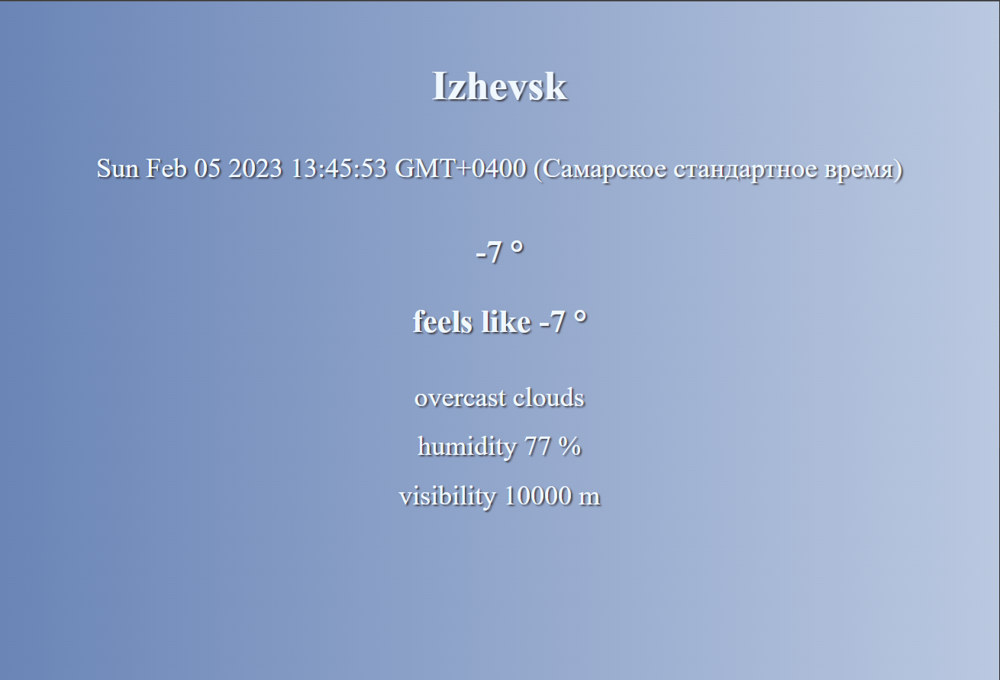

<h2 align="center">Hello, World! </h2>

<h1 align="center">I'm Iuliia, frontend developer</h1>

<h3 align="center">My skills:<h3>

<table width="320px">
    <tbody>
        <tr valign="top">
            <td width="80px" align="center">
            <strong>HTML</strong> 
            
            </td>
            <td width="80px" align="center">
            <strong>CSS</strong> 
            
            </td>
            <td width="80px" align="center">
            <strong>Sass</strong> 
            
            </td>
            <td width="80px" align="center"><strong>Bootstrap</strong> 
            
            </td>
            <td width="80px" align="center">
            <strong>VS Code</strong> 
            
            </td>
            <td width="80px" align="center">
            <strong>JS</strong> 
            
            </td>
            <td width="80px" align="center">
            <strong>React</strong> 
            
            </td>
            <td width="80px" align="center">
            <strong>npm</strong> 
            
            </td>
            <td width="80px" align="center">
            <strong>GitHub</strong> 
            
            <td width="80px" align="center">
            <strong>Git</strong> 
            
            </td> 
        </tr>
    </tbody>
</table>

<h3>In this project - Real-time weather forecast with API 
At work - dynamic layout creation, change the city by the user, add the library to display the time of any city
</h3>
<h4>Thanks to ITGIRLSCHOOL</h4>

This site is live at https://iuliia-bogdanova.github.io/weather/

<!-- # weather
week20 task2
2. Сделайте простенький сайт, который будет получать данные с сервера - используйте любой открытый API. Это может быть, например, список галактик от NASA или список ваших проектов на Github. Или что угодно еще, что вы захотите реализовать. *В процессе разработки использовать хотя бы 1 запрос к серверу через команду fetch.*
    
    Примеры открытых и бесплатных API:
    
    [https://developers.giphy.com/docs/api](https://developers.giphy.com/docs/api) (гифки)
    
    [https://api.nasa.gov/](https://api.nasa.gov/) (данные NASA)
    
    [https://openweathermap.org/api](https://openweathermap.org/api) (погода, требует генерации ключа)

    лучше динамически создавать верстку, а не создавать ее в HTML :подмигивание:
.then(weather => {
            const weatherInfo = `
              
${weather.name}

              
${new Date()}

... и т д

Кот Ученый
  4 д. назад
Кроме того, тебе будет проще отображать несколько разных городов (или других данных), получив данные в виде массива и поместив создание блока в цикл 

библиотека day.js позволяет тонко настраивать время -->